# Wokwi setup
- Setup Hosted Wokwi Development

    0. Register for an account at https://wokwi.com, then click the "Sign Up" button in the top right.

    1. After registering, click your profile picture in the top right and go to "My Projects" (https://wokwi.com/dashboard/projects).

    2. Create a new project by clicking the "New Project" button.
    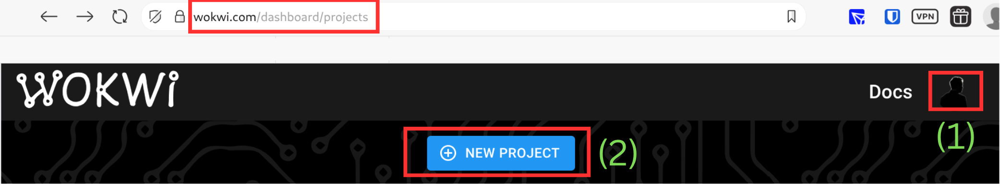

    3. In this example, we use an ESP32-C3. Find the ESP32-C3 microcontroller under ESP32. *Please note: the microcontroller may change throughout the lab.*
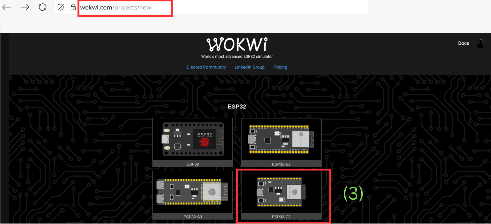

    4. After selecting the microcontroller, select the "Arduino" beginner template.
    -  You should now see a development environment with files like sketch.ino and diagram.json, plus a simulation environment with the ESP32-C3-MINI-1.
        - If you can't see any components, you may have zoomed in or out too far.
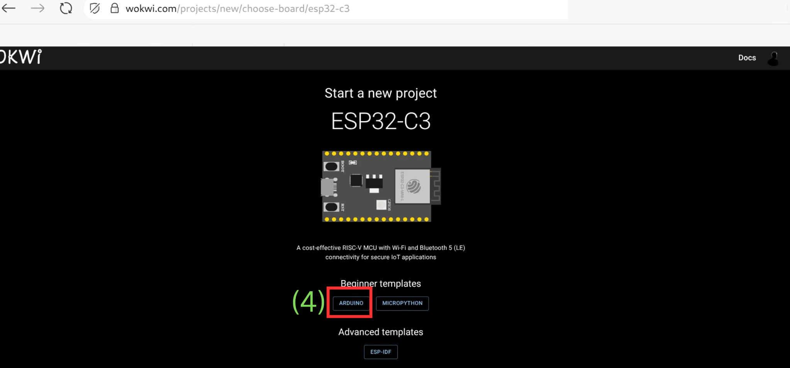
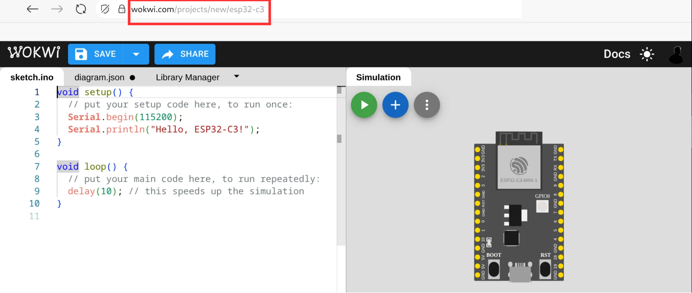

    5. For the labs, you'll copy the diagram.json code from here and paste it into VSCode in your Codespace.
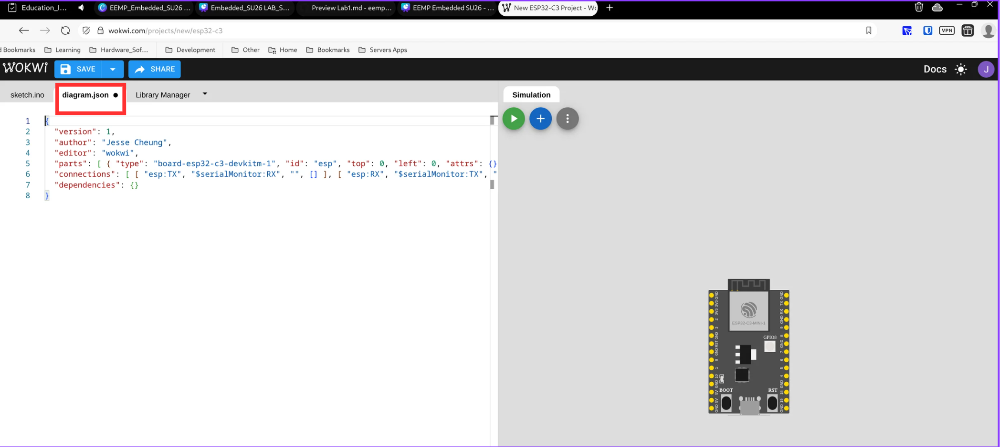

# VSCode Wokwi

1. Download the GitHub repo. You'll need a github.com account first. Go to https://github.com/Science-Mentorship-Institute/eemp_embedded_sys
  -> Click on "Use this template"
  -> "Open in codespaces"
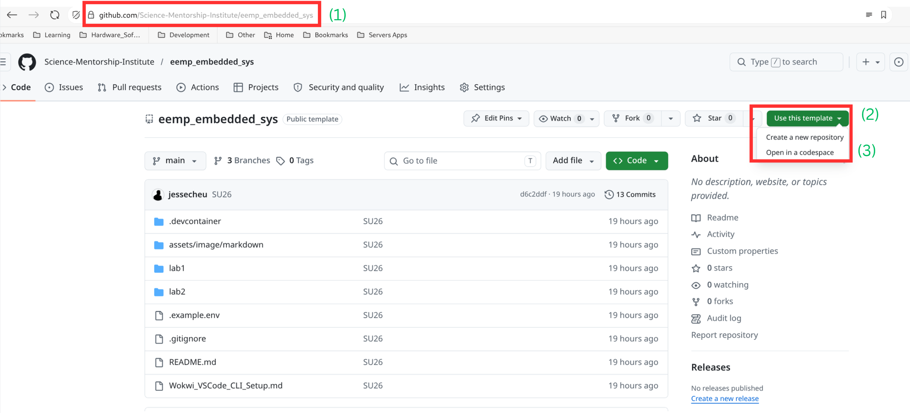

2. **Codespace initialization**: After pressing "Open in a codespace", your Codespace should look similar to the picture below. Please wait patiently while it loads all the VSCode extensions.
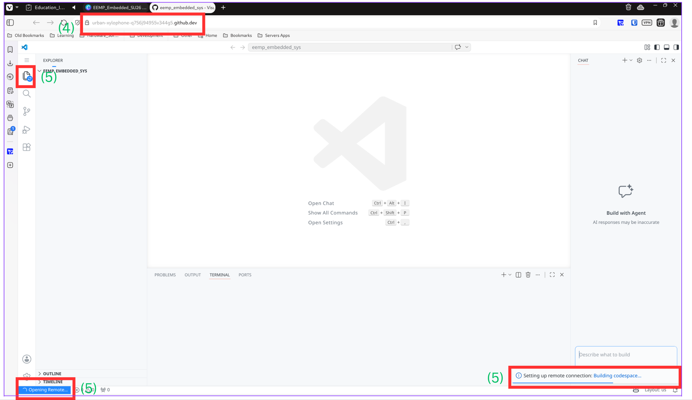
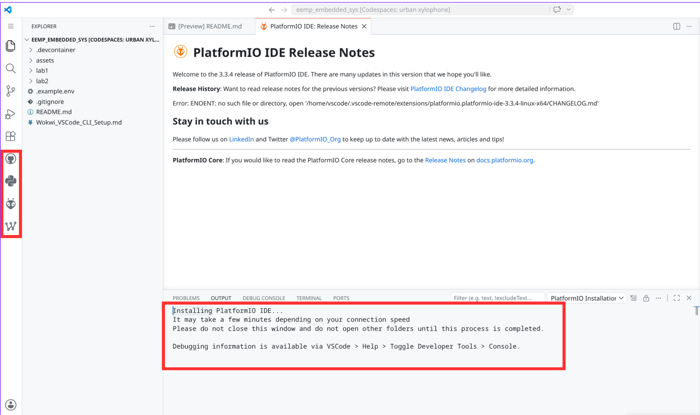

3. A popup will tell you to restart the Codespace. Do this by refreshing the page.
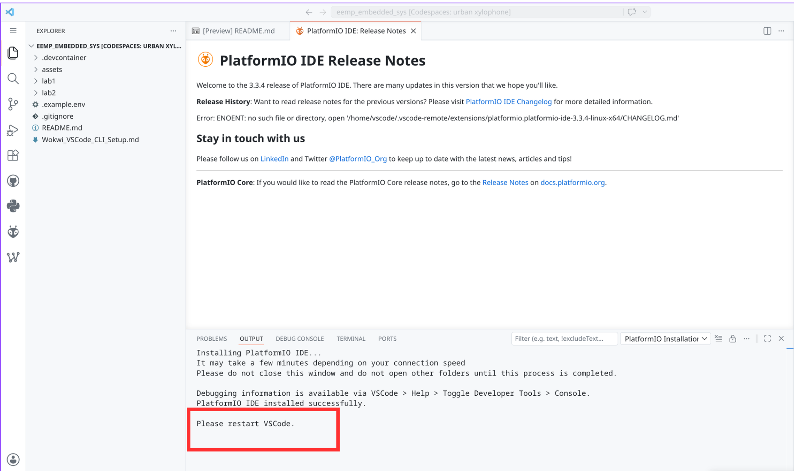

4. Setting up the Wokwi CLI token
- Copy the .example.env file to create a .env file in the same directory. You may need to enable clipboard access.
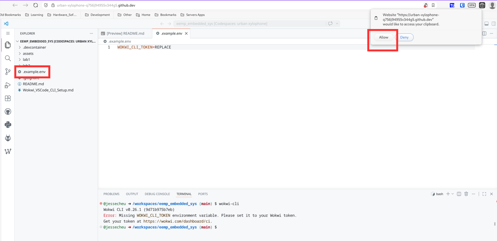
- Go to the [Wokwi CI token page](https://wokwi.com/dashboard/ci) and click "Create A New Token".
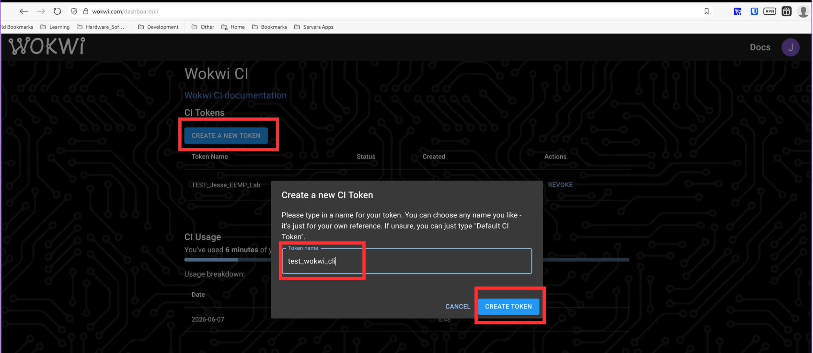
- Then copy that token.
- Find the .example.env file in the root directory, duplicate it, and rename the copy to .env. Then replace REPLACE in `WOKWI_CLI_TOKEN=REPLACE` with your token.
- Alternatively, in the terminal run `export WOKWI_CLI_TOKEN=<your token>` (replacing `<your token>` with the token you copied).
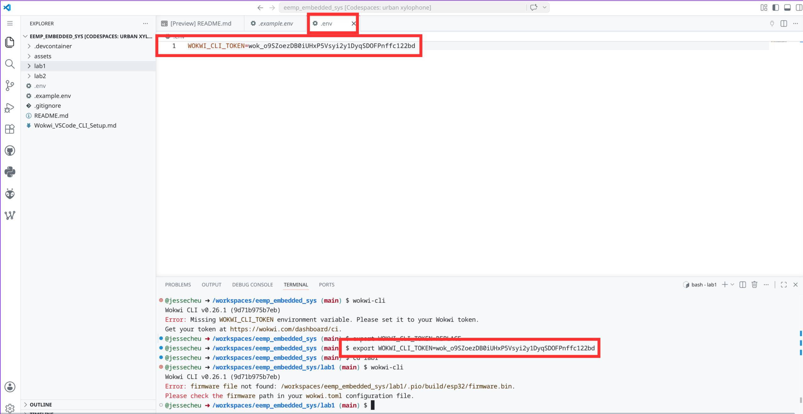

5. Activate the Wokwi Simulator Extension
To get Wokwi access in VSCode, you need to add a Wokwi license. Find the Wokwi Simulator extension in the left sidebar of your Codespace's VSCode; it will direct you to a link where you can request a license.
- Click on "Request a New Wokwi License", which will direct you to Wokwi's website, or you can go to https://wokwi.com/dashboard/ci
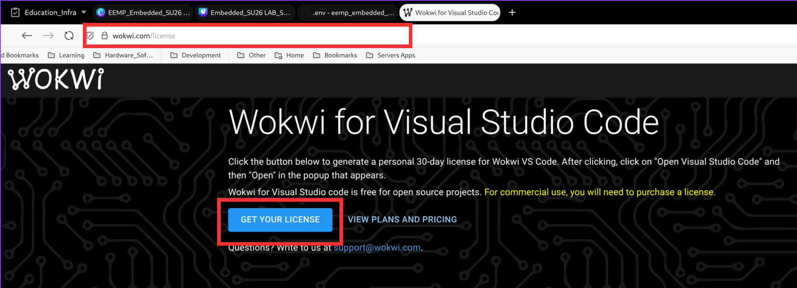
- Click on "Get Your License" and copy the license
- In the Wokwi simulator extension, click "Enter License Key" and enter the license key
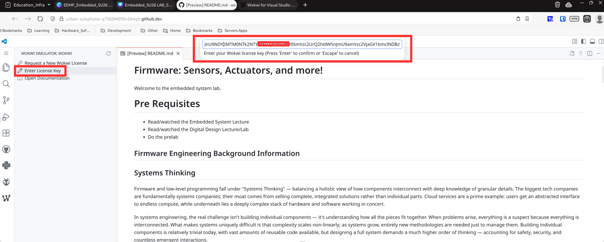

## Navigating the lab

### Notes
- Lab 1 and Lab 2 use the Arduino C language instead of regular C or MicroPython.
- Lab completion: students are assigned a multiple-choice quiz.

6. To preview the notes, right-click the markdown file (.md) and select "Open Preview". For example, see the picture below.
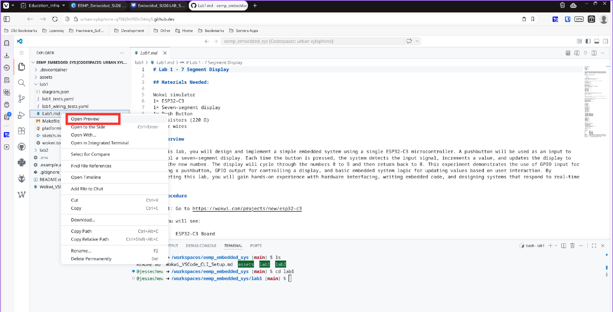

7. sketch.ino is where you place the lab code. You'll need to fill in the blanks.
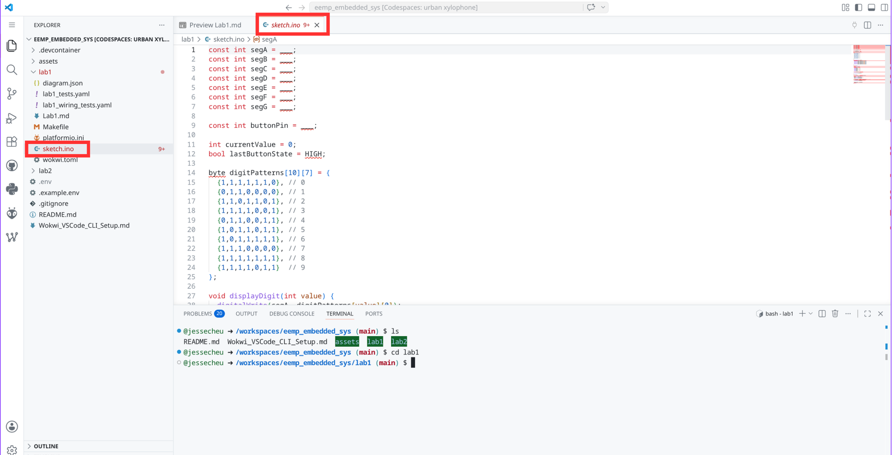

8. diagram.json is where you place the lab's schematic. Each lab's `diagram.json` starts almost empty (it contains only the bare ESP32-C3 board). You build the circuit on wokwi.com following the pin tables in the lab notes, then copy that diagram.json and paste it here, replacing the contents. The simulator and `make test-all` will not work until you do this.
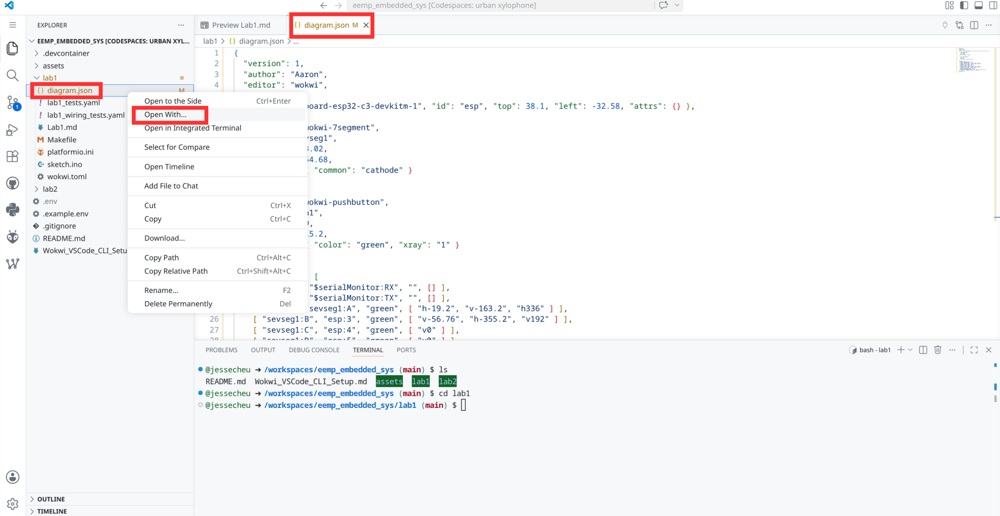
- To edit the raw schematic JSON, right-click diagram.json, choose "Open with...", and select "Text Editor".
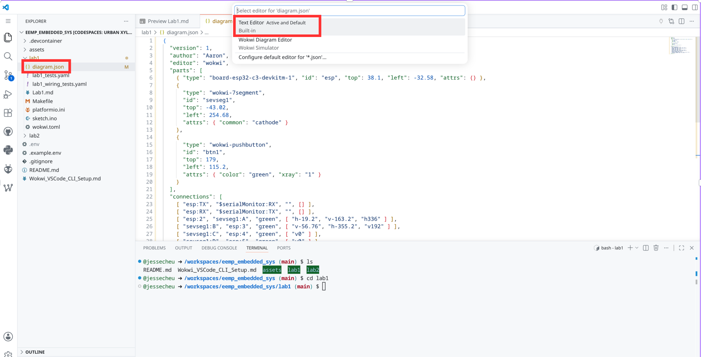
- To open it as a Wokwi simulator, select "Wokwi Diagram Editor".
- The Wokwi simulator requires the Wokwi license — see the VSCode Wokwi section for more information.

## Running the Unit Tests
- Note: the unit tests are there to help you answer the quiz questions. They don't need to pass in order for the assignment to be graded as complete.
- This requires the Wokwi CLI to be set up. For more information, see the VSCode Wokwi section.

9. In the Codespace's VSCode terminal:
- Go to the lab directory with `cd lab1`
- To go back up one directory, use `cd ..`
- Run `make test-all`
- Note: If the wiring_tests.yaml is failing but the regular tests are passing, ignore the wiring tests.
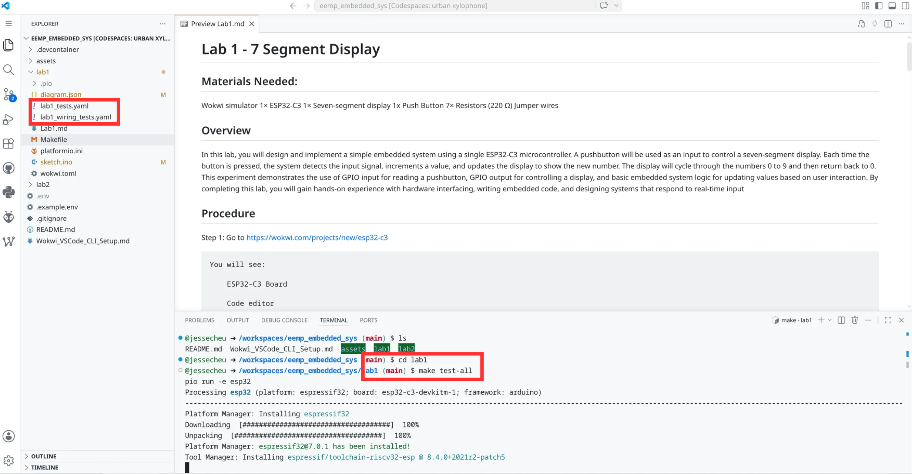

10. The unit tests pass when you see something similar to below.
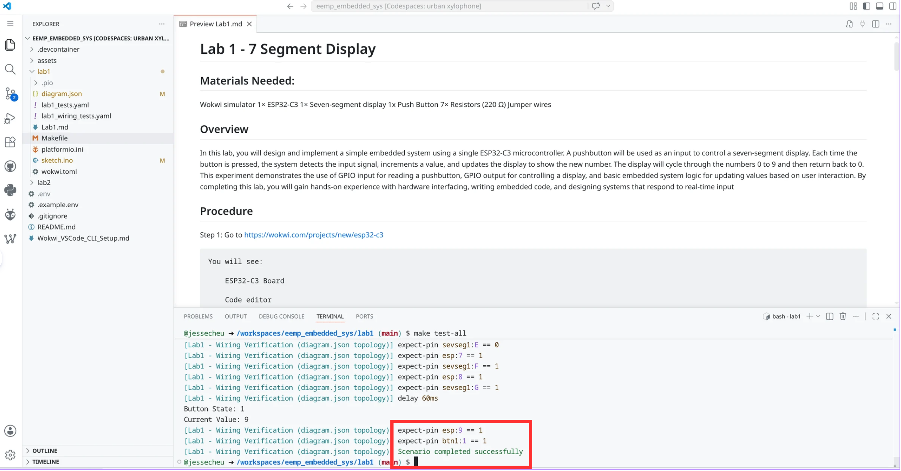
