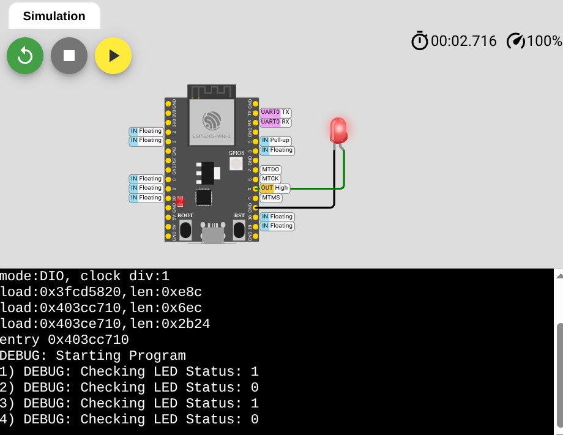

# Firmware: Sensors, Actuators, and more!
Welcome to the embedded system lab. 

# Pre Requisites
- Read/watched the Embedded System Lecture
- Read/watched the Digital Design Lecture/Lab
- Read the prelab about MicroPython
- Do the prelab

## Prelab 
- Setup Hosted Wokwi Development
    - Register for an account by going to https://wokwi.com then click on the "Sign Up" Button on the top right. 
    - After registering, Click on your profile picture on the top right and goto "My Projects". https://wokwi.com/dashboard/projects
    - Afterwards, Create a "New Project" by clicking on the new project button.  
    - In this example, we use a ESP32-C3. Find the ESP32-C3 microcontroller under ESP32. *Please note: The microcontroller may change throughout the lab.*
    - After selecting the microcontroller, select "Micropython" Beginner Templates.
    -  You should now see a development environment with files like main.py and diagram.json. You should also see a simulation environment with the ESP32-C3-MINI-1. 
        - If you can't, you may be zoomed out or zoomed in too much. 
    - Next, Try out Sample 1: Blinking LED 

# Background 
- In this lab, you will go over how electronics are developed at the software layer using a simulation software called Wokwi. 

### Micropython
Micropython is a programming language specifically designed for microcontrollers that often have very little memory to store programs. Micropython is based on python 3 so most of the syntax follows python 3. The difference between Micropython and Python 3 is that micropython is specifically designed for microcontrollers so there are **less** general purpose libraries for micropython. 

**If you haven't ever coded before, please take a short tutorial on learning python:** https://www.w3schools.com/python/ 

Before the lab, please take a look at documentation and become familiar with Micropython. 

Here are some reference documentation for Micropython:
- https://docs.micropython.org/en/latest/


## Firmware Engineering Background Information

## Systems Thinking

Firmware and Low level programming is under a paradigm called "Systems Thinking" where you balance  understanding how different components within a complicated system connects to each other and granular details. Most of the biggest technology companies are "systems" companies, their big moat is because they sell full-systems instead of individual components. Think about cloud services, you can purchase through an abstracted interface and access endless compute power. Underneath the hood, cloud services is insanely complicated with many complicated parts, separated between hardware and software. 

In systems engineering, your job really isn't to program and create individual components but to figure out how the different pieces of the puzzles fit in. When problems occur, you have to consider everything since everything is interconnected. Systems is interesting and very difficult because as systems grow, complexity balloons too a place where you actually have to develop different methodology to accomodate. Creating individual components is actually fairly easy in today's world infact, nowadays you don't really need to create new code since many code is reusable but when you create a system, you have to consider everything like safety and security. 

It is important to balance both the "fine" details and the larger picture of how individual components fit into a larger system. There are downsides to prioritizing the "fine" details since you can lose the larger picture. But there are also downsides to thinking about the larger picture since the "attention" to detail is lost. 

For the upcoming information, try to look through the lens of "Systems Thinking"

## Electronics and Firmware
Electronics are created through a mix of analog and digital circuit components. Firmware directly accesses mainly the digital circuit components through an interface. Often, this interface is through a microcontroller. Microcontrollers consist of registers that allow programs to directly access to control the behavior of the underlying circuit.

### Abstraction: Application Programming Interface (API)
An application programming interface (API) is a abstraction layer that programmers create to keep granular details a secret to keep complexity in check. Simply put, API's are libraries of code that has already been created to be reused. API's methods are either accessors or mutators. Accessors will read out information whereas mutators will modify objects. 

### High Level API Calls

High Level API is an abstraction layer that ultimately calls lower level programming API. 

In micropython, a simple example is blinking an LED. See: https://wokwi.com/projects/359801682833812481

```
from machine import Pin
from utime import sleep

led = Pin(15, Pin.OUT) # Instantiating the LED object 
while True:
  led.on()
  sleep(0.5)
  led.off()
  sleep(0.5)
```

By importing "machine", you get access to the "Pin" object. Underneath the hood, you are creating an object that has the declared pins ready to go for a specific microcontroller and then calling functions that have been already created to get the led to blink. Lower level details are abstracted away so you need to look at documentation to figure out how to use the "Pin" object. For more information, see: https://docs.micropython.org/en/latest/pyboard/tutorial/leds.html

### Low Level API Calls

Low level programming directly works with hardware using mechanisms like register level access and communication protocols. Low level APIs is the granular details that higher level APIs abstract away. Low level programming ties alot to digital design lectures because ultimately many of the details that you need to understand low level programming comes from the digital design space. 

Also in micropython, this is the same algorithm to blink an LED but with more granular details using register level access.
```
# Example 1: Lower Level API Access
from machine import mem32
import time

# ESP32 GPIO Register Base Address
GPIO_BASE_ADDR = 0x3FF44000

# Offsets from base
GPIO_OUT_OFFSET        = 0x04  # Read output level
GPIO_OUT_W1TS_OFFSET   = 0x08  # Set output (1 = HIGH)
GPIO_OUT_W1TC_OFFSET   = 0x0C  # Clear output (1 = LOW)
GPIO_ENABLE_OFFSET     = 0x20  # Output enable

# Functionality register address
GPIO_OUT_REG      = GPIO_BASE_ADDR + GPIO_OUT_OFFSET
GPIO_OUT_W1TS_REG = GPIO_BASE_ADDR + GPIO_OUT_W1TS_OFFSET
GPIO_OUT_W1TC_REG = GPIO_BASE_ADDR + GPIO_OUT_W1TC_OFFSET
GPIO_ENABLE_REG   = GPIO_BASE_ADDR + GPIO_ENABLE_OFFSET

# Choose the GPIO pin
GPIO_NUM = 15
PIN_MASK = 1 << GPIO_NUM #0b1 << GPIO_NUM = 0b1000...00 , numbers of zeros depende on the GPIO Num

# Set GPIO2 as output
mem32[GPIO_ENABLE_REG] |= PIN_MASK

# Blink loop
while True:
    print(f"Before ON: GPIO_OUT = {bin(mem32[GPIO_OUT_REG])}")
    mem32[GPIO_OUT_W1TS_REG] = PIN_MASK  # LED ON
    print(f"After ON:  GPIO_OUT = {bin(mem32[GPIO_OUT_REG])}")
    time.sleep(0.5)
    print(f"Before OFF: GPIO_OUT = {bin(mem32[GPIO_OUT_REG])}")
    mem32[GPIO_OUT_W1TC_REG] = PIN_MASK  # LED OFF
    print(f"After OFF: GPIO_OUT = {bin(mem32[GPIO_OUT_REG])}")
    time.sleep(0.5)
```
Link: https://wokwi.com/projects/438145871326704641

You may ask, where does these magic numbers come from? See Link: [ESP32 Technical Manual](https://www.mouser.com/pdfdocs/ESP32-Tech_Reference.pdf?srsltid=AfmBOopwrhod4EnESqcg54uDPF-MAuQZXA1Mrt7IrSkeaRs3pkWa2d7T&utm_source=chatgpt.com)

- On Page 59. Under 4.12 Register Summary


## Hardware 
Since we are doing all this in simulation, the hardware aspect is software defined. This means that the components exists as description that the simulation software reads to understand. In the real world, you do need to understand the hardware aspect of the system. 

## Wokwi: Interface 
- Play Button
- Components 
### Wokwi: Python Interactive Console (REPL)
Micropython also gives you an interactive REPL so you can run python commands in a live environment. The python interactive console allows you to experience, test, and debug code without a file. Instead of writing code in the "text file" environment, you can write that same code in the REPL and it will do the same thing. 

# Sample 0: Complexity and Debugging tips
- Use a Logic Analyzer
- Using the Micropython REPL 
- Separate various components to individual files to manage complexity
- Optional: Source Level Debugging

In this example, we will show the same LED blinking as Sample 1 along with usage of an OLED screen to show the I2C Protocol using the Logic Analyzer/REPL. 

Board: ESP32-C3
</br>Link: https://wokwi.com/projects/433858272977254401

## main.py 

<details>
<summary>main.py code</summary>

```
from machine import Pin, I2C
import ssd1306

#LED 
led = Pin(10, Pin.OUT)
led.on()

#OLED Screen 
i2c = I2C(0, scl=Pin(4), sda=Pin(5))

oled_width = 128
oled_height = 64
oled = ssd1306.SSD1306_I2C(oled_width, oled_height, i2c)

oled.text('Hello, Wokwi!', 10, 10)      
oled.show()
```
</details>

## diagram.json

<details>
<summary>diagram.json code</summary>

```
{
  "version": 1,
  "author": "Sci-Mi",
  "editor": "wokwi",
  "parts": [
    {
      "type": "board-esp32-c3-devkitm-1",
      "id": "esp",
      "top": 0,
      "left": 0,
      "attrs": { "env": "micropython-20231227-v1.22.0" }
    },
    {
      "type": "board-ssd1306",
      "id": "oled1",
      "top": 70.34,
      "left": 173.03,
      "attrs": { "i2cAddress": "0x3c" }
    },
    {
      "type": "wokwi-logic-analyzer",
      "id": "logic1",
      "top": 271,
      "left": 37.85,
      "rotate": 90,
      "attrs": {}
    },
    {
      "type": "wokwi-led",
      "id": "led1",
      "top": 63.6,
      "left": -149.8,
      "attrs": { "color": "red" }
    },
    {
      "type": "wokwi-resistor",
      "id": "r1",
      "top": 109.55,
      "left": -96,
      "attrs": { "value": "1000" }
    }
  ],
  "connections": [
    [ "esp:TX", "$serialMonitor:RX", "", [] ],
    [ "esp:RX", "$serialMonitor:TX", "", [] ],
    [ "oled1:GND", "esp:GND.9", "black", [ "v0" ] ],
    [ "oled1:VCC", "esp:3V3.1", "red", [ "v-86.4", "h-239.85", "v38.4" ] ],
    [ "oled1:SCL", "esp:4", "orange", [ "v-48", "h-66.9", "v86.4" ] ],
    [ "oled1:SDA", "esp:5", "green", [ "v-57.6", "h-86.33", "v86.4" ] ],
    [ "logic1:D0", "esp:5", "green", [ "v0" ] ],
    [ "logic1:D1", "esp:4", "orange", [ "v0" ] ],
    [ "logic1:GND", "esp:GND.6", "black", [ "v-67.2", "h28.8", "v-19.2" ] ],
    [ "r1:2", "esp:10", "blue", [ "v0" ] ],
    [ "led1:A", "r1:1", "blue", [ "v0" ] ],
    [ "led1:C", "esp:GND.5", "black", [ "v0" ] ],
    [ "logic1:D2", "r1:2", "blue", [ "v-38.4", "h-172.8" ] ]
  ],
  "dependencies": {}
}
```
</details>

## ssd1306.py

<details>
<summary>ssd1306.py code</summary>

```
#MicroPython SSD1306 OLED driver, I2C and SPI interfaces created by Adafruit

import time
import framebuf

# register definitions
SET_CONTRAST        = const(0x81)
SET_ENTIRE_ON       = const(0xa4)
SET_NORM_INV        = const(0xa6)
SET_DISP            = const(0xae)
SET_MEM_ADDR        = const(0x20)
SET_COL_ADDR        = const(0x21)
SET_PAGE_ADDR       = const(0x22)
SET_DISP_START_LINE = const(0x40)
SET_SEG_REMAP       = const(0xa0)
SET_MUX_RATIO       = const(0xa8)
SET_COM_OUT_DIR     = const(0xc0)
SET_DISP_OFFSET     = const(0xd3)
SET_COM_PIN_CFG     = const(0xda)
SET_DISP_CLK_DIV    = const(0xd5)
SET_PRECHARGE       = const(0xd9)
SET_VCOM_DESEL      = const(0xdb)
SET_CHARGE_PUMP     = const(0x8d)


class SSD1306:
    def __init__(self, width, height, external_vcc):
        self.width = width
        self.height = height
        self.external_vcc = external_vcc
        self.pages = self.height // 8
        # Note the subclass must initialize self.framebuf to a framebuffer.
        # This is necessary because the underlying data buffer is different
        # between I2C and SPI implementations (I2C needs an extra byte).
        self.poweron()
        self.init_display()

    def init_display(self):
        for cmd in (
            SET_DISP | 0x00, # off
            # address setting
            SET_MEM_ADDR, 0x00, # horizontal
            # resolution and layout
            SET_DISP_START_LINE | 0x00,
            SET_SEG_REMAP | 0x01, # column addr 127 mapped to SEG0
            SET_MUX_RATIO, self.height - 1,
            SET_COM_OUT_DIR | 0x08, # scan from COM[N] to COM0
            SET_DISP_OFFSET, 0x00,
            SET_COM_PIN_CFG, 0x02 if self.height == 32 else 0x12,
            # timing and driving scheme
            SET_DISP_CLK_DIV, 0x80,
            SET_PRECHARGE, 0x22 if self.external_vcc else 0xf1,
            SET_VCOM_DESEL, 0x30, # 0.83*Vcc
            # display
            SET_CONTRAST, 0xff, # maximum
            SET_ENTIRE_ON, # output follows RAM contents
            SET_NORM_INV, # not inverted
            # charge pump
            SET_CHARGE_PUMP, 0x10 if self.external_vcc else 0x14,
            SET_DISP | 0x01): # on
            self.write_cmd(cmd)
        self.fill(0)
        self.show()

    def poweroff(self):
        self.write_cmd(SET_DISP | 0x00)

    def contrast(self, contrast):
        self.write_cmd(SET_CONTRAST)
        self.write_cmd(contrast)

    def invert(self, invert):
        self.write_cmd(SET_NORM_INV | (invert & 1))

    def show(self):
        x0 = 0
        x1 = self.width - 1
        if self.width == 64:
            # displays with width of 64 pixels are shifted by 32
            x0 += 32
            x1 += 32
        self.write_cmd(SET_COL_ADDR)
        self.write_cmd(x0)
        self.write_cmd(x1)
        self.write_cmd(SET_PAGE_ADDR)
        self.write_cmd(0)
        self.write_cmd(self.pages - 1)
        self.write_framebuf()

    def fill(self, col):
        self.framebuf.fill(col)

    def pixel(self, x, y, col):
        self.framebuf.pixel(x, y, col)

    def scroll(self, dx, dy):
        self.framebuf.scroll(dx, dy)

    def text(self, string, x, y, col=1):
        self.framebuf.text(string, x, y, col)


class SSD1306_I2C(SSD1306):
    def __init__(self, width, height, i2c, addr=0x3c, external_vcc=False):
        self.i2c = i2c
        self.addr = addr
        self.temp = bytearray(2)
        # Add an extra byte to the data buffer to hold an I2C data/command byte
        # to use hardware-compatible I2C transactions.  A memoryview of the
        # buffer is used to mask this byte from the framebuffer operations
        # (without a major memory hit as memoryview doesn't copy to a separate
        # buffer).
        self.buffer = bytearray(((height // 8) * width) + 1)
        self.buffer[0] = 0x40  # Set first byte of data buffer to Co=0, D/C=1
        self.framebuf = framebuf.FrameBuffer1(memoryview(self.buffer)[1:], width, height)
        super().__init__(width, height, external_vcc)

    def write_cmd(self, cmd):
        self.temp[0] = 0x80 # Co=1, D/C#=0
        self.temp[1] = cmd
        self.i2c.writeto(self.addr, self.temp)

    def write_framebuf(self):
        # Blast out the frame buffer using a single I2C transaction to support
        # hardware I2C interfaces.
        self.i2c.writeto(self.addr, self.buffer)

    def poweron(self):
        pass


class SSD1306_SPI(SSD1306):
    def __init__(self, width, height, spi, dc, res, cs, external_vcc=False):
        self.rate = 10 * 1024 * 1024
        dc.init(dc.OUT, value=0)
        res.init(res.OUT, value=0)
        cs.init(cs.OUT, value=1)
        self.spi = spi
        self.dc = dc
        self.res = res
        self.cs = cs
        self.buffer = bytearray((height // 8) * width)
        self.framebuf = framebuf.FrameBuffer1(self.buffer, width, height)
        super().__init__(width, height, external_vcc)

    def write_cmd(self, cmd):
        self.spi.init(baudrate=self.rate, polarity=0, phase=0)
        self.cs.high()
        self.dc.low()
        self.cs.low()
        self.spi.write(bytearray([cmd]))
        self.cs.high()

    def write_framebuf(self):
        self.spi.init(baudrate=self.rate, polarity=0, phase=0)
        self.cs.high()
        self.dc.high()
        self.cs.low()
        self.spi.write(self.buffer)
        self.cs.high()

    def poweron(self):
        self.res.high()
        time.sleep_ms(1)
        self.res.low()
        time.sleep_ms(10)
        self.res.high()
```
</details>


# Sample 1: Blinking LED. 
Blinks a LED. 

Board: ESP32-C3
Link: https://wokwi.com/projects/433782979021457409

## main.py

<details>
<summary>main.py code</summary>

```
1 from machine import Pin
2 from utime import sleep
3 # Comment: Blinks a LED
4 counter = 0 
5 print("DEBUG: Starting Program")
6 
7 led = Pin(5, Pin.OUT)
8 while True:
9  led.on()
10 sleep(0.5)
11 counter += 1
12 print("%d) DEBUG: Checking LED Status: %d" % (counter, led.value()))
13 led.off()
14 counter += 1
15 print(f"{counter}) DEBUG: Checking LED Status: {led.value()}")
16 sleep(0.5)
```
<br>Line 1,2: Importing libraries. Code that are accessed.
<br>Line 4: This counter shows that the program runs sequentially. 
<br>Line 5: Example of using Print statements
<br>Line 7: The Pin object exists in the "machine" library. Instantiating an Object of type "PIN" to be used as an output pin.
<br>Line 8: while True: keeps the loop and program running infinitely long. 
<br>Line 9: led.on() turns the pin to be high. So the voltage at that pin is HIGH. 
<br>Line 10, 16: sleep(0.5) makes the 
<br>Line 11, 14: Increments the counter to show the program running sequentially. 
<br>Line 12, 15: Print statements that shows various ways to show variables along with a string. 
<br> Line 13: led.off() turns the pin to be low. So the voltage at that pin is LOW.  

</details>

## diagram.json

<details>
<summary>diagram.json code</summary>

```
{
  "version": 1,
  "author": "Sci-Mi",
  "editor": "wokwi",
  "parts": [
    {
      "type": "board-esp32-c3-devkitm-1",
      "id": "esp",
      "top": 0,
      "left": 0,
      "attrs": { "env": "micropython-20231227-v1.22.0" }
    },
    { "type": "wokwi-led", "id": "led1", "top": 25.2, "left": 157.4, "attrs": { "color": "red" } }
  ],
  "connections": [
    [ "esp:TX", "$serialMonitor:RX", "", [] ],
    [ "esp:RX", "$serialMonitor:TX", "", [] ],
    [ "esp:GND.7", "led1:C", "black", [ "h0" ] ],
    [ "esp:5", "led1:A", "green", [ "h0" ] ]
  ],
  "dependencies": {}
}
```
</details>
</br>



# Sample 2: Acceleration Sensor Reading
Reads acceleration readings

Board: ESP32-DevKit-C-V4
</br>Link: https://wokwi.com/projects/433793637802253313

<details>
<summary>main.py code</summary>

## main.py
```
# Author: andoug / Original Project Link: https://wokwi.com/projects/384474225375726593
from machine import Pin, I2C
import ssd1306
import mpu6050
import time


# ESP32 Pin assignment 
i2c = I2C(0, scl=Pin(22), sda=Pin(21))

oled_width = 128
oled_height = 64
oled = ssd1306.SSD1306_I2C(oled_width, oled_height, i2c)

mpu = mpu6050.MPU6050(i2c)

# wake up the MPU6050 from sleep
mpu.wake()
gyro = ""
accel = ""
temp = ""
# continuously print the data
while True:
    new_gyro = mpu.read_gyro_data()
    new_accel = mpu.read_accel_data()
    temperature = mpu.read_temperature()
    if(new_gyro != gyro or new_accel != accel or temperature != temp):
      gyro = new_gyro
      accel = new_accel
      temp = temperature
      print("Gyro: " + str(gyro) + ", Accel: " + str(accel))
      oled.fill(0)
      oled.text("Gyro", 0, 2)
      oled.text("-----------------", 0, 10)
      oled.text("x:"+ str(round(gyro[0],2)), 0, 15)
      oled.text("y:"+ str(round(gyro[1],2)), 0, 25)
      oled.text("z:"+ str(round(gyro[2],2)), 0, 35)
      oled.text("Accel", 70, 2)
      oled.text("x:"+ str(round(accel[0],2)), 70, 15)
      oled.text("y:"+ str(round(accel[1],2)), 70, 25)
      oled.text("z:"+ str(round(accel[2],2)), 70, 35)
      oled.text("Temp", 0, 45)
      oled.text("------------"+str(temperature), 0, 48)
      
      oled.show()
    time.sleep(0.1)

```
</details>

## diagram.json
<details>
<summary>diagram.json code</summary>

```
{
  "version": 1,
  "author": "Uri Shaked",
  "editor": "wokwi",
  "parts": [
    {
      "type": "board-esp32-devkit-c-v4",
      "id": "esp",
      "top": 9.6,
      "left": -100.76,
      "attrs": { "env": "micropython-20231005-v1.21.0" }
    },
    { "type": "board-ssd1306", "id": "oled1", "top": 99.14, "left": 57.83, "attrs": {} },
    { "type": "wokwi-mpu6050", "id": "imu1", "top": 109.42, "left": -247.28, "attrs": {} }
  ],
  "connections": [
    [ "esp:TX", "$serialMonitor:RX", "", [] ],
    [ "esp:RX", "$serialMonitor:TX", "", [] ],
    [ "oled1:SCL", "esp:22", "green", [ "v0" ] ],
    [ "oled1:SDA", "esp:21", "blue", [ "v-19.2", "h-124.73" ] ],
    [ "oled1:GND", "esp:GND.2", "black", [ "v-67.2", "h-96" ] ],
    [ "oled1:VCC", "esp:3V3", "red", [ "v-28.8", "h0.15", "v-76.8", "h-201.75" ] ],
    [ "imu1:VCC", "esp:3V3", "red", [ "v0" ] ],
    [ "imu1:GND", "esp:GND.2", "black", [ "v-105.6", "h182.48" ] ],
    [ "imu1:SCL", "esp:22", "green", [ "v0" ] ],
    [ "imu1:SDA", "esp:21", "blue", [ "v0" ] ]
  ],
  "dependencies": {}
}
```

</details>

## ssd1306.py

<details>
<summary>ssd1306.py code</summary>

```
#MicroPython SSD1306 OLED driver, I2C and SPI interfaces created by Adafruit

import time
import framebuf

# register definitions
SET_CONTRAST        = const(0x81)
SET_ENTIRE_ON       = const(0xa4)
SET_NORM_INV        = const(0xa6)
SET_DISP            = const(0xae)
SET_MEM_ADDR        = const(0x20)
SET_COL_ADDR        = const(0x21)
SET_PAGE_ADDR       = const(0x22)
SET_DISP_START_LINE = const(0x40)
SET_SEG_REMAP       = const(0xa0)
SET_MUX_RATIO       = const(0xa8)
SET_COM_OUT_DIR     = const(0xc0)
SET_DISP_OFFSET     = const(0xd3)
SET_COM_PIN_CFG     = const(0xda)
SET_DISP_CLK_DIV    = const(0xd5)
SET_PRECHARGE       = const(0xd9)
SET_VCOM_DESEL      = const(0xdb)
SET_CHARGE_PUMP     = const(0x8d)


class SSD1306:
    def __init__(self, width, height, external_vcc):
        self.width = width
        self.height = height
        self.external_vcc = external_vcc
        self.pages = self.height // 8
        # Note the subclass must initialize self.framebuf to a framebuffer.
        # This is necessary because the underlying data buffer is different
        # between I2C and SPI implementations (I2C needs an extra byte).
        self.poweron()
        self.init_display()

    def init_display(self):
        for cmd in (
            SET_DISP | 0x00, # off
            # address setting
            SET_MEM_ADDR, 0x00, # horizontal
            # resolution and layout
            SET_DISP_START_LINE | 0x00,
            SET_SEG_REMAP | 0x01, # column addr 127 mapped to SEG0
            SET_MUX_RATIO, self.height - 1,
            SET_COM_OUT_DIR | 0x08, # scan from COM[N] to COM0
            SET_DISP_OFFSET, 0x00,
            SET_COM_PIN_CFG, 0x02 if self.height == 32 else 0x12,
            # timing and driving scheme
            SET_DISP_CLK_DIV, 0x80,
            SET_PRECHARGE, 0x22 if self.external_vcc else 0xf1,
            SET_VCOM_DESEL, 0x30, # 0.83*Vcc
            # display
            SET_CONTRAST, 0xff, # maximum
            SET_ENTIRE_ON, # output follows RAM contents
            SET_NORM_INV, # not inverted
            # charge pump
            SET_CHARGE_PUMP, 0x10 if self.external_vcc else 0x14,
            SET_DISP | 0x01): # on
            self.write_cmd(cmd)
        self.fill(0)
        self.show()

    def poweroff(self):
        self.write_cmd(SET_DISP | 0x00)

    def contrast(self, contrast):
        self.write_cmd(SET_CONTRAST)
        self.write_cmd(contrast)

    def invert(self, invert):
        self.write_cmd(SET_NORM_INV | (invert & 1))

    def show(self):
        x0 = 0
        x1 = self.width - 1
        if self.width == 64:
            # displays with width of 64 pixels are shifted by 32
            x0 += 32
            x1 += 32
        self.write_cmd(SET_COL_ADDR)
        self.write_cmd(x0)
        self.write_cmd(x1)
        self.write_cmd(SET_PAGE_ADDR)
        self.write_cmd(0)
        self.write_cmd(self.pages - 1)
        self.write_framebuf()

    def fill(self, col):
        self.framebuf.fill(col)

    def pixel(self, x, y, col):
        self.framebuf.pixel(x, y, col)

    def scroll(self, dx, dy):
        self.framebuf.scroll(dx, dy)

    def text(self, string, x, y, col=1):
        self.framebuf.text(string, x, y, col)


class SSD1306_I2C(SSD1306):
    def __init__(self, width, height, i2c, addr=0x3c, external_vcc=False):
        self.i2c = i2c
        self.addr = addr
        self.temp = bytearray(2)
        # Add an extra byte to the data buffer to hold an I2C data/command byte
        # to use hardware-compatible I2C transactions.  A memoryview of the
        # buffer is used to mask this byte from the framebuffer operations
        # (without a major memory hit as memoryview doesn't copy to a separate
        # buffer).
        self.buffer = bytearray(((height // 8) * width) + 1)
        self.buffer[0] = 0x40  # Set first byte of data buffer to Co=0, D/C=1
        self.framebuf = framebuf.FrameBuffer1(memoryview(self.buffer)[1:], width, height)
        super().__init__(width, height, external_vcc)

    def write_cmd(self, cmd):
        self.temp[0] = 0x80 # Co=1, D/C#=0
        self.temp[1] = cmd
        self.i2c.writeto(self.addr, self.temp)

    def write_framebuf(self):
        # Blast out the frame buffer using a single I2C transaction to support
        # hardware I2C interfaces.
        self.i2c.writeto(self.addr, self.buffer)

    def poweron(self):
        pass


class SSD1306_SPI(SSD1306):
    def __init__(self, width, height, spi, dc, res, cs, external_vcc=False):
        self.rate = 10 * 1024 * 1024
        dc.init(dc.OUT, value=0)
        res.init(res.OUT, value=0)
        cs.init(cs.OUT, value=1)
        self.spi = spi
        self.dc = dc
        self.res = res
        self.cs = cs
        self.buffer = bytearray((height // 8) * width)
        self.framebuf = framebuf.FrameBuffer1(self.buffer, width, height)
        super().__init__(width, height, external_vcc)

    def write_cmd(self, cmd):
        self.spi.init(baudrate=self.rate, polarity=0, phase=0)
        self.cs.high()
        self.dc.low()
        self.cs.low()
        self.spi.write(bytearray([cmd]))
        self.cs.high()

    def write_framebuf(self):
        self.spi.init(baudrate=self.rate, polarity=0, phase=0)
        self.cs.high()
        self.dc.high()
        self.cs.low()
        self.spi.write(self.buffer)
        self.cs.high()

    def poweron(self):
        self.res.high()
        time.sleep_ms(1)
        self.res.low()
        time.sleep_ms(10)
        self.res.high()
```

</details>

## mpu6050.py
<details>
<summary>mpu6050.py code</summary>

```
"""
A lightweight MicroPython implementation for interfacing with an MPU-6050 via I2C. 
Author: Tim Hanewich - https://github.com/TimHanewich
Version: 1.0
Get updates to this code file here: https://github.com/TimHanewich/MicroPython-Collection/blob/master/MPU6050/MPU6050.py
License: MIT License
Copyright 2023 Tim Hanewich
Permission is hereby granted, free of charge, to any person obtaining a copy of this software and associated documentation files (the “Software”), to deal in the Software without restriction, including without limitation the rights to use, copy, modify, merge, publish, distribute, sublicense, and/or sell copies of the Software, and to permit persons to whom the Software is furnished to do so, subject to the following conditions:
The above copyright notice and this permission notice shall be included in all copies or substantial portions of the Software.
THE SOFTWARE IS PROVIDED “AS IS”, WITHOUT WARRANTY OF ANY KIND, EXPRESS OR IMPLIED, INCLUDING BUT NOT LIMITED TO THE WARRANTIES OF MERCHANTABILITY, FITNESS FOR A PARTICULAR PURPOSE AND NONINFRINGEMENT. IN NO EVENT SHALL THE AUTHORS OR COPYRIGHT HOLDERS BE LIABLE FOR ANY CLAIM, DAMAGES OR OTHER LIABILITY, WHETHER IN AN ACTION OF CONTRACT, TORT OR OTHERWISE, ARISING FROM, OUT OF OR IN CONNECTION WITH THE SOFTWARE OR THE USE OR OTHER DEALINGS IN THE SOFTWARE.
"""

import machine

class MPU6050:
    """Class for reading gyro rates and acceleration data from an MPU-6050 module via I2C."""
    
    def __init__(self, i2c:machine.I2C, address:int = 0x68):
        """
        Creates a new MPU6050 class for reading gyro rates and acceleration data.
        :param i2c: A setup I2C module of the machine module.
        :param address: The I2C address of the MPU-6050 you are using (0x68 is the default).
        """
        self.address = address
        self.i2c = i2c
        
    def wake(self) -> None:
        """Wake up the MPU-6050."""
        self.i2c.writeto_mem(self.address, 0x6B, bytes([0x01]))

    def sleep(self) -> None:
        """Places MPU-6050 in sleep mode (low power consumption). Stops the internal reading of new data. Any calls to get gyro or accel data while in sleep mode will remain unchanged - the data is not being updated internally within the MPU-6050!"""
        self.i2c.writeto_mem(self.address, 0x6B, bytes([0x40]))
        
    def who_am_i(self) -> int:
        """Returns the address of the MPU-6050 (ensure it is working)."""
        return self.i2c.readfrom_mem(self.address, 0x75, 1)[0]
    
    def read_temperature(self) -> float:
        """Reads the temperature, in celsius, of the onboard temperature sensor of the MPU-6050."""
        data = self.i2c.readfrom_mem(self.address, 0x41, 2)
        raw_temp:float = self._translate_pair(data[0], data[1])
        temp:float = (raw_temp / 340.0) + 36.53
        return temp

    def read_gyro_range(self) -> int:
        """Reads the gyroscope range setting."""
        return self._hex_to_index(self.i2c.readfrom_mem(self.address, 0x1B, 1)[0])
        
    def write_gyro_range(self, range:int) -> None:
        """Sets the gyroscope range setting."""
        self.i2c.writeto_mem(self.address, 0x1B, bytes([self._index_to_hex(range)]))
        
    def read_gyro_data(self) -> tuple[float, float, float]:
        """Read the gyroscope data, in a (x, y, z) tuple."""
        
        # set the modified based on the gyro range (need to divide to calculate)
        gr:int = self.read_gyro_range()
        modifier:float = None
        if gr == 0:
            modifier = 131.0
        elif gr == 1:
            modifier = 65.5
        elif gr == 2:
            modifier = 32.8
        elif gr == 3:
            modifier = 16.4
            
        # read data
        data = self.i2c.readfrom_mem(self.address, 0x43, 6) # read 6 bytes (gyro data)
        x:float = (self._translate_pair(data[0], data[1])) / modifier
        y:float = (self._translate_pair(data[2], data[3])) / modifier
        z:float = (self._translate_pair(data[4], data[5])) / modifier
        
        return (x, y, z)
                
    def read_accel_range(self) -> int:
        """Reads the accelerometer range setting."""
        return self._hex_to_index(self.i2c.readfrom_mem(self.address, 0x1C, 1)[0])
    
    def write_accel_range(self, range:int) -> None:
        """Sets the gyro accelerometer setting."""
        self.i2c.writeto_mem(self.address, 0x1C, bytes([self._index_to_hex(range)]))
        
    def read_accel_data(self) -> tuple[float, float, float]:
        """Read the accelerometer data, in a (x, y, z) tuple."""
        
        # set the modified based on the gyro range (need to divide to calculate)
        ar:int = self.read_accel_range()
        modifier:float = None
        if ar == 0:
            modifier = 16384.0
        elif ar == 1:
            modifier = 8192.0
        elif ar == 2:
            modifier = 4096.0
        elif ar == 3:
            modifier = 2048.0
            
        # read data
        data = self.i2c.readfrom_mem(self.address, 0x3B, 6) # read 6 bytes (accel data)
        x:float = (self._translate_pair(data[0], data[1])) / modifier
        y:float = (self._translate_pair(data[2], data[3])) / modifier
        z:float = (self._translate_pair(data[4], data[5])) / modifier
        
        return (x, y, z)
        
    def read_lpf_range(self) -> int:
        return self.i2c.readfrom_mem(self.address, 0x1A, 1)[0]
    
    def write_lpf_range(self, range:int) -> None:
        """
        Sets low pass filter range.
        :param range: Low pass range setting, 0-6. 0 = minimum filter, 6 = maximum filter.
        """

        # check range
        if range < 0 or range > 6:
            raise Exception("Range '" + str(range) + "' is not a valid low pass filter setting.")
        
        self.i2c.writeto_mem(self.address, 0x1A, bytes([range]))

            
    #### UTILITY FUNCTIONS BELOW ####
        
    def _translate_pair(self, high:int, low:int) -> int:
        """Converts a byte pair to a usable value. Borrowed from https://github.com/m-rtijn/mpu6050/blob/0626053a5e1182f4951b78b8326691a9223a5f7d/mpu6050/mpu6050.py#L76C39-L76C39."""
        value = (high << 8) + low
        if value >= 0x8000:
            value = -((65535 - value) + 1)
        return value   

    def _hex_to_index(self, range:int) -> int:
        """Converts a hexadecimal range setting to an integer (index), 0-3. This is used for both the gyroscope and accelerometer ranges."""
        if range== 0x00:
            return 0
        elif range == 0x08:
            return 1
        elif range == 0x10:
            return 2
        elif range == 0x18:
            return 3
        else:
            raise Exception("Found unknown gyro range setting '" + str(range) + "'")
        
    def _index_to_hex(self, index:int) -> int:
        """Converts an index integer (0-3) to a hexadecimal range setting. This is used for both the gyroscope and accelerometer ranges."""
        if index == 0:
            return 0x00
        elif index == 1:
            return 0x08
        elif index == 2:
            return 0x10
        elif index == 3:
            return 0x18
        else:
            raise Exception("Range index '" + index + "' invalid. Must be 0-3.")
```
</details>

# Sample 3: Controlling a FAN
Controls a FAN using a servo and a temperature sensor

Board: ESP32-S3 
</br>Link: https://wokwi.com/projects/433798826999639041


## main.py
<details>
<summary>main.py code</summary>

```
from machine import Pin, PWM, ADC
import utime, math
import onewire, ds18x20
from time import sleep

# Temperature Sensor ADC Setup

BETA = 3950
adc = ADC(Pin(19))
adc.atten(ADC.ATTN_11DB)

def Servo(pwm, angle):
    pwm.duty(int(((angle)/180 *2 + 0.5) / 20 * 1023)) 

def read_ntc_temperature():
    analog_value = adc.read()
    print(analog_value)
    temperature_celsius = 1 / (math.log(1 / (4096 / analog_value - 1)) / BETA + 1.0 / 298.15) - 273.15
    return temperature_celsius

while True:
    temperature = read_ntc_temperature()
    print("Temperature: {:.2f} ℃".format(temperature))
    # pwm
    servo_pin = Pin(5)
    servo_freq = 50
    servo_pwm = 1
    pwm = PWM(servo_pin, freq=servo_freq, duty=servo_pwm) #Defaults to Low Fan Speed
    if temperature > 10 and temperature < 30:
        # Medium Fan Speed
        servo_pwm = 100
        pwm = PWM(servo_pin, freq=servo_freq, duty=servo_pwm)
    elif temperature > 30:
        # High Fan Speed
        servo_pwm = 255
        pwm = PWM(servo_pin, freq=servo_freq, duty=servo_pwm)       
    print(f"DEBUG: Servo PWM: {servo_pwm}")
    Servo(pwm, 180)
    sleep(1)
    Servo(pwm, 0)
    sleep(1)
```
</details>

## diagram.json
<details>
<summary>diagram.json code</summary>

```
{
  "version": 1,
  "author": "Sci-Mi",
  "editor": "wokwi",
  "parts": [
    {
      "type": "board-esp32-s3-devkitc-1",
      "id": "esp",
      "top": -0.18,
      "left": 4.57,
      "attrs": { "env": "micropython-20231227-v1.22.0", "flashSize": "8" }
    },
    { "type": "wokwi-servo", "id": "servo1", "top": 121, "left": -191, "rotate": 90, "attrs": {} },
    {
      "type": "wokwi-ntc-temperature-sensor",
      "id": "ntc1",
      "top": 155.8,
      "left": 230.4,
      "rotate": 180,
      "attrs": {}
    }
  ],
  "connections": [
    [ "esp:TX", "$serialMonitor:RX", "", [] ],
    [ "esp:RX", "$serialMonitor:TX", "", [] ],
    [ "servo1:GND", "esp:GND.1", "black", [ "v-9.6", "h57.6", "v144" ] ],
    [ "servo1:V+", "esp:3V3.2", "red", [ "v0" ] ],
    [ "esp:5", "servo1:PWM", "violet", [ "h-120.28", "v9.42" ] ],
    [ "ntc1:GND", "esp:GND.3", "black", [ "h-48", "v19.2" ] ],
    [ "ntc1:VCC", "esp:3V3.2", "red", [ "h-19.2", "v-153.6" ] ],
    [ "ntc1:OUT", "esp:19", "blue", [ "h-57.6", "v28.9" ] ]
  ],
  "dependencies": {}
}
```
</details>

# Exercise 1: Making a simple robot
Exercise 1 integrates all the samples to make an entire robot system. 

Board: ESP32-S3 
</br>Link: Answers to be released later.

# Exercise 2: Make your own Embedded System
Exercise 1 should take all the separate components that you previously built in Sample 1-4 and expand it more to use multiple sensors and multiple actuators. 
This exercise is more opened ended.

Board: ESP32-S3 
</br>Link: Make your own project. You will submit a link to this later. 

Choose an embedded system that you want to do. 
</br>Examples:
- Robotics
- Biology Monitoring Device
- Medical Device using Sensors and Display


# Other (Optional):
