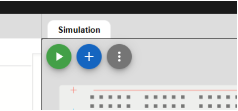
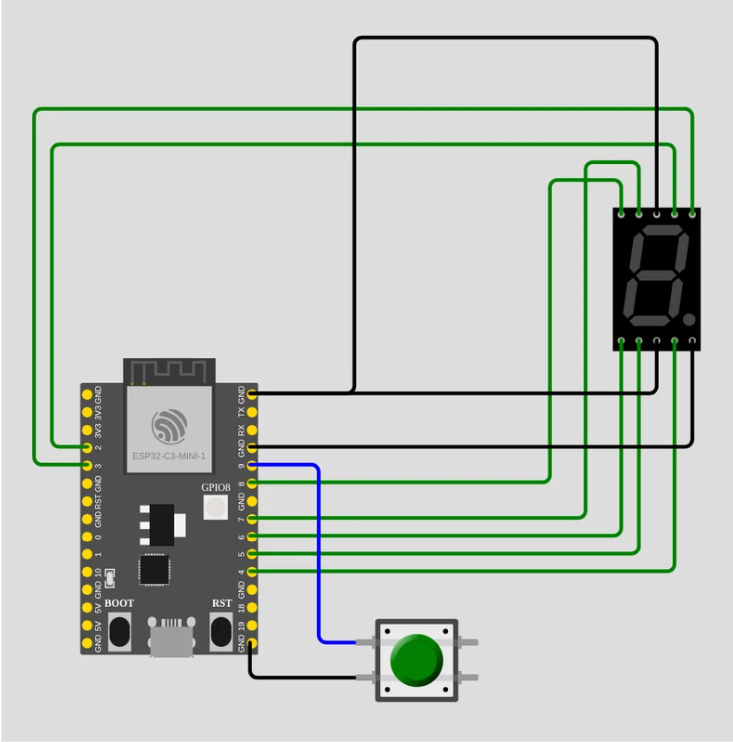

# Lab 1 - 7 Segment Display

## Materials Needed: 

Wokwi simulator
1× ESP32-C3
1× Seven-segment display
1x Push Button
7× Resistors (220 Ω)
Jumper wires

## Overview

In this lab, you will design and implement a simple embedded system using a single ESP32-C3 microcontroller. A pushbutton will be used as an input to control a seven-segment display. Each time the button is pressed, the system detects the input signal, increments a value, and updates the display to show the new number. The display will cycle through the numbers 0 to 9 and then return back to 0. This experiment demonstrates the use of GPIO input for reading a pushbutton, GPIO output for controlling a display, and basic embedded system logic for updating values based on user interaction. By completing this lab, you will gain hands-on experience with hardware interfacing, writing embedded code, and designing systems that respond to real-time input

## Procedure

Step 1: Go to https://wokwi.com/projects/new/esp32-c3

    You will see:

        ESP32-C3 Board
        
        Code editor

        Diagram workspace

Step 2: Add your components. Click the Blue + button on the top right



Step 3: System overview

In this lab, a pushbutton is used to increment a number displayed on a seven-segment display.

Each time the button is pressed:

The value increases by 1
The display updates accordingly
After 9, the display resets back to 0

This demonstrates:

Digital output control (7-segment display)
Digital input (pushbutton)
Embedded logic implementation

Step 4: Connect the display to the ESP32 so it can show numbers (0–9).

Part 1: Connect Segment Pins (A–G)

| Display    | Connect to ESP32 |
| --------   | --------         |
| sevseg1:A  | GPIO2            |
| sevseg1:B  | GPIO3            |
| sevseg1:C  | GPIO4            |
| sevseg1:D  | GPIO5            |
| sevseg1:E  | GPIO6            |
| sevseg1:F  | GPIO7            |
| sevseg1:G  | GPIO8            |
| COM.1      | GND              |
| COM.2      | GND              |

Step 5: Wire the pushbutton

The pushbutton will be used to trigger sending data allowing us to increment the number. 

| Push Button    | Connect to ESP32 |
| --------       | --------         |
| Btn1: 1.l      | GPIO9            |

Step 6

This picture shows what your schematic should look like. Remember that the seven-segment display must be set to common cathode.This means that both COM.1 and COM.2 must be connected to GND.




Step 7: Copy your circuit into your Codespace

Once your schematic on wokwi.com matches the picture above, switch to the **diagram.json** tab in the Wokwi web editor, select all of its text, and copy it. Then open `lab1/diagram.json` in your Codespace (it starts almost empty, containing only the bare ESP32-C3 board) and paste your circuit in, replacing the existing contents. This is the circuit that the Wokwi simulator and the unit tests (`make test-all`) will use, so the simulation will not work until you do this.


Step 8:  Now in this step, you will complete the provided starter code to control the seven-segment display using a pushbutton. There is a word bank at the very bottom of this page to help.

By the end of this your code will do the following:

Define the correct GPIO pins
Configure the ESP32 pins properly
Detect when the button is pressed
Increment a number from 0 to 9
Display the number on the seven-segment display


```
const int segA = ___;
const int segB = ___;
const int segC = ___;
const int segD = ___;
const int segE = ___;
const int segF = ___;
const int segG = ___;

const int buttonPin = ___;

int currentValue = 0;
bool lastButtonState = HIGH;

byte digitPatterns[10][7] = {
  {1,1,1,1,1,1,0}, // 0
  {0,1,1,0,0,0,0}, // 1
  {1,1,0,1,1,0,1}, // 2
  {1,1,1,1,0,0,1}, // 3
  {0,1,1,0,0,1,1}, // 4
  {1,0,1,1,0,1,1}, // 5
  {1,0,1,1,1,1,1}, // 6
  {1,1,1,0,0,0,0}, // 7
  {1,1,1,1,1,1,1}, // 8
  {1,1,1,1,0,1,1}  // 9
};

void displayDigit(int value) {
  digitalWrite(segA, digitPatterns[value][0]);
  digitalWrite(segB, digitPatterns[value][1]);
  digitalWrite(segC, digitPatterns[value][2]);
  digitalWrite(segD, digitPatterns[value][3]);
  digitalWrite(segE, digitPatterns[value][4]);
  digitalWrite(segF, digitPatterns[value][5]);
  digitalWrite(segG, digitPatterns[value][6]);
}

void setup() {
  Serial.begin(115200);

  pinMode(segA, ______);
  pinMode(segB, ______);
  pinMode(segC, ______);
  pinMode(segD, ______);
  pinMode(segE, ______);
  pinMode(segF, ______);
  pinMode(segG, ______);

  pinMode(buttonPin, ____________);

  displayDigit(currentValue);
}

void loop() {
  bool buttonState = digitalRead(buttonPin);

  Serial.print("Button State: ");
  Serial.println(buttonState);
  Serial.print("Current Value: ");
  Serial.println(currentValue);

  if (buttonState == ______ && lastButtonState == ______) {
    currentValue = _______________________;
    displayDigit(currentValue);
  }

  lastButtonState = buttonState;
  delay(50);
}
```

## Word Bank Choice

| Word Bank Choice   | Explanation                       |
| --------           | --------                          |
| 2                  | GPIO Pin for segment A            |
| 3                  | GPIO Pin for segment B            |
| 4                  | GPIO Pin for segment C            |
| 5                  | GPIO Pin for segment D            |
| 6                  | GPIO Pin for segment E            |
| 7                  | GPIO Pin for segment F            |
| 8                  | GPIO Pin for segment G            |
| 9                  | GPIO Pin for the pushbutton       |
| OUTPUT             |     Used for the display pins because the ESP32 sends signals to the seven-segment display  |
| INPUT_PULLUP      |     Used for the button pin: turns on the ESP32's internal pull-up resistor, so the pin idles HIGH when released and reads LOW when the button is pressed |
| LOW               |     Means the button is pressed in this circuit — pressing connects the pin to GND and pulls it LOW                               |
| HIGH              |     The button's released (resting) state, held high by the pull-up; used as the previous state so a press is detected as a HIGH → LOW change                                |
| (currentValue + 1) % 10 |     Increases the number by 1 and resets back to 0 after 9                             |