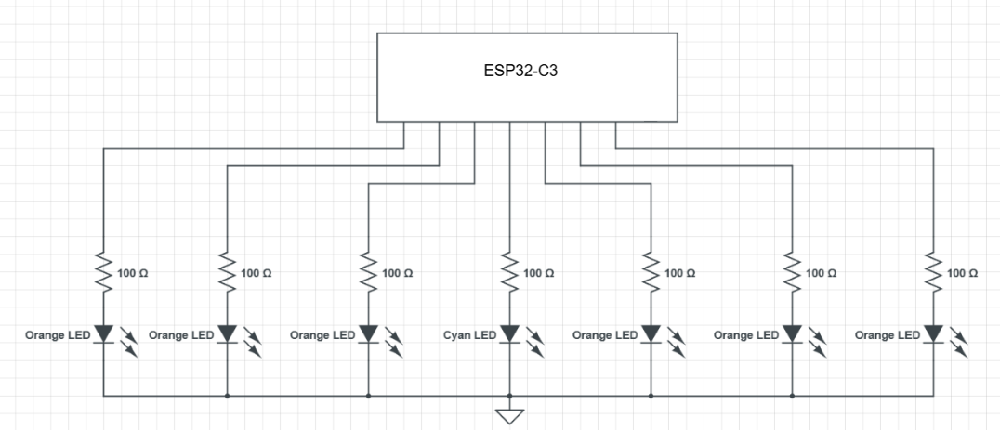
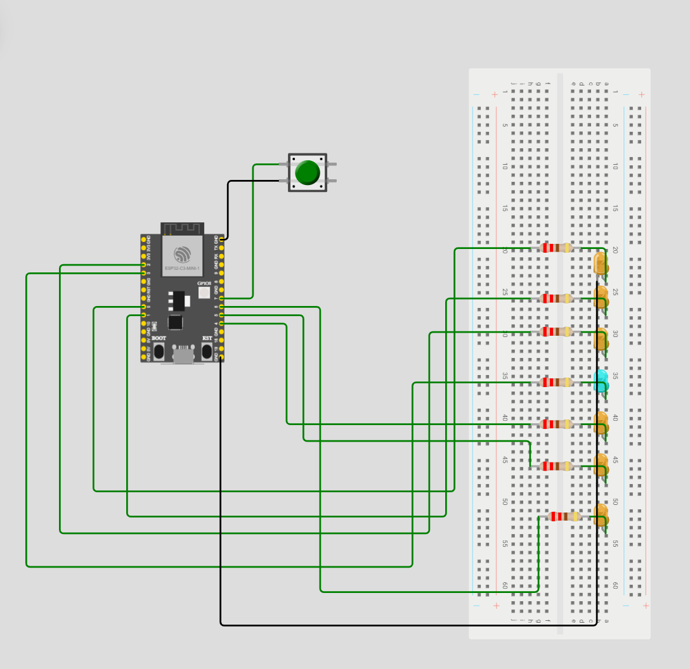

# Lab2 - Arcade Game Lab

Materials Needed: 

Wokwi simulator
1x ESP32-C3
1x Breadboard
7x 100 Ohm Resistors
6x Orange LEDs (Or any color - they just all need to be the same)
1x Cyan LEDs (Or any color other than the one selected above)
1x Push Button

## Overview:

The game "cyclone" is a common sight in many arcades. This game presents a ring of lights where only one light is illuminated at a time and moves quickly across the ring. The user can stop the light from moving by pressing the large button positioned in front of them. The goal of the game is to stop the light directly in front of the user within a pair of goal arches. The operation of this game can be seen in the following YouTube video: 

[Cyclone Arcade Game, 10 tries at it with a BIG JACKPOT WIN at Salisbury Beach :) (From 5/5/18)](https://www.youtube.com/watch?v=9-XAB7g7R84&t=3s)


The objective of this lab was to design and simulate a Cyclone-style arcade game using an ESP32-C3 in Wokwi. The system had to:


-Control 7 LEDs
-Use the center LED as the target
-Move one illuminated LED back and forth
-Detect button presses
-Use a software state machine
-Show a win pattern if the center LED was selected
-Hold the current LED position if the wrong LED was selected
-Reset the game when the button was pressed again


## Procedure:

**Step 1: Build the Circuit in Wokwi**

The first step was to create the circuit in the Wokwi simulator. Seven LEDs were connected to the ESP32-C3 through current-limiting resistors. A pushbutton was also connected to a GPIO pin and ground. The LEDs were arranged in a row, and the center LED was chosen as the target LED.



Each LED was assigned its own GPIO pin. The center LED was given a different color so that it could be easily identified as the target. The button was used to start the game, stop the moving LED, and reset the game after a win or loss.

The LEDs followed the configuration:

GPIO pin → resistor → LED anode
LED cathode → ground rail


The ground rail of the breadboard was connected to the ESP32 ground pin to complete the circuit. A pushbutton was connected between a GPIO pin and ground. The internal pull-up resistor of the ESP32 was used, meaning the button reads HIGH when not pressed and LOW when pressed.


**Step 2: Pin configuration**

Each LED was assigned a specific GPIO pin:

| GPIO PIN    | LED & Button |
| --------    | --------     |
| GPIO0       | LED1         |
| GPIO1       | LED2         |
| GPIO2       | LED3         |
| GPIO3       | LED4         |
| GPIO4       | LED5         |
| GPIO5       | LED6         |
| GPIO6       | LED7         |
| GPIO7       | Button       |

The pushbutton was connected to: GPIO7 → button → GND



Once your circuit on wokwi.com matches the diagram above, switch to the **diagram.json** tab in the Wokwi web editor, select all of its text, and copy it. Then open `lab2/diagram.json` in your Codespace (it starts almost empty, containing only the bare ESP32-C3 board) and paste your circuit in, replacing the existing contents. This is the circuit that the Wokwi simulator and the unit tests (`make test-all`) will use, so the simulation will not work until you do this.

Note: For the tests, you may need to replace the word "btn" in lab2_tests.yaml for the word "btn1" if wokwi uses the component name "btn1" instead of "btn".

**Step 3: Software Design**

The system was implemented using a software state machine with the following states:

Idle State:
The center LED is turned on, waiting for the user to start the game.
Move Right State:
The LED moves from the top toward the bottom.
Move Left State:
The LED moves from the bottom toward the top.
Win State:
All LEDs blink to indicate success.
Lose State:
The LED remains at the position where the user stopped it.

State transitions occur based on button presses and LED position.


**Step 4: Complete the starter code. There is a word bank at the bottom of this page for you to use.**


```
enum GameState {
  ST_IDLE = 0,
  ____________________,
  ____________________,
  ____________________,
  ____________________
};

const int LED_COUNT = ______;
const int ledPins[LED_COUNT] = {______, ______, ______, ______, ______, ______, ______};
const int TARGET_INDEX = ______;
const int BUTTON_PIN = ______;

const unsigned long MOVE_DELAY_MS = ______;
const unsigned long WIN_BLINK_DELAY_MS = ______;
const unsigned long DEBOUNCE_MS = ______;

GameState state = ____________________;
int pos = ______;

unsigned long lastMoveTime = 0;
unsigned long lastBlinkTime = 0;
unsigned long lastButtonTime = 0;
bool blinkState = false;

int shownIndex = -1;  // which LED ledShowIndex() last lit; used by reportStatus()


void ledsAllOff() {
  for (int i = 0; i < LED_COUNT; i++) {
    ______________________________________;
  }
}

void ledsAllOn() {
  for (int i = 0; i < LED_COUNT; i++) {
    ______________________________________;
  }
}

void ledShowIndex(int idx) {
  // Drive each pin straight to its final level. (Doing ledsAllOff() first would blink
  // the target LED LOW->HIGH on every loop, a flicker the pin reads can sample.)
  for (int i = 0; i < LED_COUNT; i++) {
    digitalWrite(ledPins[i], (i == idx) ? HIGH : LOW);
  }
  shownIndex = idx;
}

void showIdlePattern() {
  ledsAllOff();
  ______________________________________;
}

bool buttonWasPressed() {
  if (digitalRead(____________________) == ______) {
    unsigned long now = millis();
    if (now - lastButtonTime > ____________________) {
      lastButtonTime = now;

      while (digitalRead(BUTTON_PIN) == LOW) {
        delay(5);
      }
      return true;
    }
  }
  return false;
}

void resetGame() {
  state = ____________________;
  pos = ______;
  blinkState = false;
  ______________________________________;
}

void reportStatus() {
  static unsigned long lastReport = 0;
  unsigned long now = millis();
  if (now - lastReport < 50) return;
  lastReport = now;

  switch (state) {
    case ST_IDLE:
      Serial.println("IDLE  | center light on -- press the button to start");
      break;
    case ST_MOVE_R:
      Serial.print("POS: ");
      Serial.print(shownIndex);
      Serial.println("  | light moving right");
      break;
    case ST_MOVE_L:
      Serial.print("POS: ");
      Serial.print(shownIndex);
      Serial.println("  | light moving left");
      break;
    case ST_WIN:
      Serial.println("WIN!  | stopped on the center -- all lights flashing");
      break;
    case ST_LOSE:
      Serial.print("LOSE  | missed the center -- light frozen at POS ");
      Serial.print(shownIndex);
      Serial.println(", press to retry");
      break;
  }
}

void setup() {
  Serial.begin(115200);

  for (int i = 0; i < LED_COUNT; i++) {
    ________________________________;
    ________________________________;
  }

  pinMode(____________________, INPUT_PULLUP);

  resetGame();
  Serial.println();
  Serial.println("====== Cyclone Arcade Game ======");
  Serial.println("Stop the moving light on the center to score!");
}

void loop() {
  unsigned long now = millis();

  switch (state) {
    case ST_IDLE:
      ______________________________________;
      if (buttonWasPressed()) {
        pos = ______;
        ledShowIndex(pos);
        state = ____________________;
        lastMoveTime = now;
      }
      break;

    case ST_MOVE_R:
      ______________________________________;

      if (buttonWasPressed()) {
        state = (pos == ____________________) ? ____________________ : ____________________;
        lastBlinkTime = now;
        blinkState = false;
        break;
      }

      if (now - lastMoveTime >=  ____________________) {
        lastMoveTime = now;
        if (pos >= ____________________) {
          state =  ____________________;
        } else {
         ____________________;
        }
      }
      break;

    case ST_MOVE_L:
      ______________________________________;

      if (buttonWasPressed()) {
        state = (pos ==  ____________________) ?  ____________________:  ____________________;
        lastBlinkTime = now;
        blinkState = false;
        break;
      }

      if (now - lastMoveTime >= ____________________) {
        lastMoveTime = now;
        if (pos <= ______) {
          state =  ____________________;
        } else {
          ____________________;
        }
      }
      break;

    case ST_WIN:
      if (now - lastBlinkTime >=  ____________________) {
        lastBlinkTime = now;
        blinkState = !blinkState;

        if (blinkState) {
          ____________________;
        } else {
           ____________________;
        }
      }

      if (buttonWasPressed()) {
        ____________________;
      }
      break;

    case ST_LOSE:
      ______________________________________;
      if (buttonWasPressed()) {
         ____________________;
      }
      break;

    default:
      ____________________;
      break;
  }

  reportStatus();  // report AFTER the LEDs have been updated, so serial matches hardware
}

```

| Blank / Section | Answer to Fill In | Hints |
|---|---|---|
| **— Constants & Setup —** | | |
| `enum GameState` blanks | A) `ST_MOVE_R, ST_MOVE_L, ST_WIN, ST_LOSE` · B) `ST_LEFT, ST_RIGHT, ST_DONE` · C) `ST_START, ST_STOP, ST_RESET` | These are the different game states. |
| `LED_COUNT = ___` | A) `5` · B) `7` · C) `10` | There are 7 LEDs in the game. |
| `ledPins[] = {...}` | A) `{1, 2, 3, 4, 5, 6, 7}` · B) `{0, 1, 2, 3, 4, 5, 6}` · C) `{2, 3, 4, 5, 6, 7, 8}` | These are the Arduino pins connected to the LEDs. |
| `TARGET_INDEX = ___` | A) `0` · B) `3` · C) `6` | The target is the center LED. Since counting starts at 0, index 3 is the middle of 7 LEDs. |
| `BUTTON_PIN = ___` | A) `9` · B) `7` · C) `13` | The button is connected to pin 7. |
| `MOVE_DELAY_MS = ___` | A) `50` · B) `500` · C) `140` | Controls how fast the LED moves. |
| `WIN_BLINK_DELAY_MS = ___` | A) `180` · B) `50` · C) `1000` | Controls how fast the LEDs blink after winning. |
| `DEBOUNCE_MS = ___` | A) `180` · B) `50` · C) `200` | Prevents one button press from being counted multiple times. |
| **— Initial State —** | | |
| `GameState state = ___` | A) `ST_MOVE_R` · B) `ST_WIN` · C) `ST_IDLE` | The game starts in the idle state. |
| `int pos = ___` | A) `0` · B) `1` · C) `-1` | Stores the current LED position; the game starts it at 0. |
| **— LED Functions —** | | |
| `digitalWrite(ledPins[i], ___)` in `ledsAllOff()` | A) `HIGH` · B) `LOW` · C) `INPUT` | Turns each LED off. |
| `digitalWrite(ledPins[i], ___)` in `ledsAllOn()` | A) `LOW` · B) `OUTPUT` · C) `HIGH` | Turns each LED on. |
| `digitalWrite(ledPins[idx], ___)` | A) `LOW` · B) `HIGH` · C) `OUTPUT` | Turns on only the selected LED. |
| `showIdlePattern()` blank | A) `digitalWrite(ledPins[0], HIGH);` · B) `digitalWrite(ledPins[TARGET_INDEX], HIGH);` · C) `ledsAllOn();` | Turns on the center LED while waiting. |
| **— Button Handling —** | | |
| `digitalRead(____)` == `____` | A) `BUTTON_PIN`, `HIGH` · B) `LED_PIN`, `LOW` · C) `BUTTON_PIN`, `LOW` | Checks if the button is pressed. With `INPUT_PULLUP`, pressed equals `LOW`. |
| `now - lastButtonTime > ____` | A) `MOVE_DELAY_MS` · B) `DEBOUNCE_MS` · C) `WIN_BLINK_DELAY_MS` | Makes sure the button press is stable. |
| **— Reset Function —** | | |
| `resetGame()` state blank | A) `ST_MOVE_R` · B) `ST_LOSE` · C) `ST_IDLE` | Sends the game back to idle. |
| `resetGame()` pos blank | A) `0` · B) `LED_COUNT` · C) `TARGET_INDEX` | Resets the stored position to 0; `showIdlePattern()` lights the center either way. |
| `resetGame()` final blank | A) `ledsAllOff();` · B) `showIdlePattern();` · C) `ledsAllOn();` | Shows the idle LED pattern again. |
| **— setup() —** | | |
| `pinMode(ledPins[i], ___)` | A) `INPUT` · B) `OUTPUT` · C) `INPUT_PULLUP` | Sets each LED pin as an output. |
| `digitalWrite(ledPins[i], ___)` in setup | A) `HIGH` · B) `LOW` · C) `OUTPUT` | Starts with LEDs off. |
| `pinMode(____, INPUT_PULLUP)` | A) `LED_PIN` · B) `TARGET_INDEX` · C) `BUTTON_PIN` | Sets the button as an input using the internal pull-up resistor. |
| **— loop() · Idle —** | | |
| `case ST_IDLE:` blank | A) `ledsAllOn();` · B) `ledShowIndex(0);` · C) `showIdlePattern();` | Keeps the center LED on while idle. |
| `pos = ___` when game starts | A) `0` · B) `TARGET_INDEX` · C) `LED_COUNT` | Starts the moving LED at the first LED. |
| `state = ___` after starting | A) `ST_IDLE` · B) `ST_MOVE_L` · C) `ST_MOVE_R` | Begins moving the LED forward. |
| **— loop() · Moving Right —** | | |
| `case ST_MOVE_R:` blank | A) `ledsAllOn();` · B) `ledShowIndex(pos);` · C) `showIdlePattern();` | Displays the current LED position. |
| `pos == ____ ? ____ : ____` | A) `0`, `ST_WIN`, `ST_LOSE` · B) `TARGET_INDEX`, `ST_WIN`, `ST_LOSE` · C) `LED_COUNT`, `ST_LOSE`, `ST_WIN` | Wins if stopped on the center LED, otherwise loses. |
| `now - lastMoveTime >= ____` | A) `DEBOUNCE_MS` · B) `WIN_BLINK_DELAY_MS` · C) `MOVE_DELAY_MS` | Checks when it is time to move the LED. |
| `if (pos >= ____)` | A) `LED_COUNT` · B) `TARGET_INDEX` · C) `LED_COUNT - 1` | Checks if the LED reached the last position. |
| `state = ____` at bottom | A) `ST_IDLE` · B) `ST_MOVE_L` · C) `ST_LOSE` | Changes direction upward. |
| `else ____` in move right | A) `pos--;` · B) `pos = 0;` · C) `pos++;` | Moves the LED one step forward. |
| **— loop() · Moving Left —** | | |
| `case ST_MOVE_L:` blank | A) `showIdlePattern();` · B) `ledShowIndex(pos);` · C) `ledsAllOff();` | Displays the current LED position. |
| `pos == ____ ? ____ : ____` | A) `TARGET_INDEX`, `ST_WIN`, `ST_LOSE` · B) `0`, `ST_WIN`, `ST_LOSE` · C) `LED_COUNT`, `ST_LOSE`, `ST_WIN` | Same win/lose check while moving left. |
| `if (pos <= ___)` | A) `TARGET_INDEX` · B) `1` · C) `0` | Checks if the LED reached the first position. |
| `state = ____` at top | A) `ST_MOVE_L` · B) `ST_IDLE` · C) `ST_MOVE_R` | Changes direction downward. |
| `else ____` in move left | A) `pos++;` · B) `pos--;` · C) `pos = 0;` | Moves the LED one step backward. |
| **— loop() · Win State —** | | |
| `ST_WIN` delay blank | A) `DEBOUNCE_MS` · B) `MOVE_DELAY_MS` · C) `WIN_BLINK_DELAY_MS` | Controls the blinking speed. |
| `if (blinkState)` blank | A) `ledsAllOff();` · B) `ledShowIndex(pos);` · C) `ledsAllOn();` | Turns all LEDs on during blink. |
| `else` blank | A) `ledsAllOff();` · B) `ledsAllOn();` · C) `showIdlePattern();` | Turns all LEDs off during blink. |
| `buttonWasPressed()` in win | A) `ledsAllOff();` · B) `resetGame();` · C) `showIdlePattern();` | Button restarts the game after winning. |
| **— loop() · Lose & Default —** | | |
| `case ST_LOSE:` blank | A) `ledsAllOn();` · B) `showIdlePattern();` · C) `ledShowIndex(pos);` | Keeps the LED on where the player lost. |
| `buttonWasPressed()` in lose | A) `showIdlePattern();` · B) `resetGame();` · C) `ledsAllOff();` | Button restarts the game after losing. |
| `default:` blank | A) `ledsAllOn();` · B) `showIdlePattern();` · C) `resetGame();` | Safety reset if something goes wrong. |

## Unit Tests: